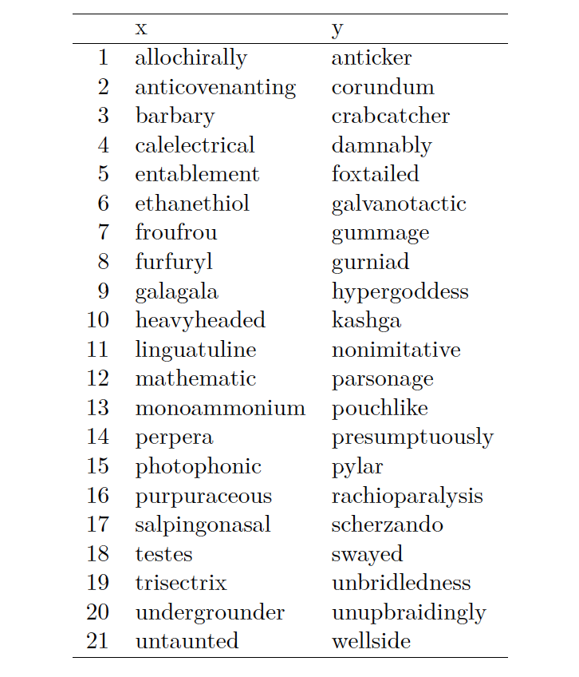

> Some simple exercises with [regular expressions](https://en.wikipedia.org/wiki/Regular_expression)...

```{r, include=FALSE}
library(tidyverse)
library(dplyr)
```

## 1. Using R

### names.txt

```{r}
names <- unlist(read.table("names.txt", sep = "\n"), use.names = FALSE)
names
```

#### (a)

Find all usernames that contain at least one numeric character.

```{r}
names[str_detect(names, "[0-9]")]
```

#### (b)
Find all usernames that are exactly four characters long and consist only of alphabetic characters.

```{r}
names[str_detect(names, "^[a-zA-Z]{4}$")]
```

#### (c)
Find all usernames following the conventional way of name format, i.e., the “given name” goes first, and the “family” name last, with any other names in-between. The names are separated by a single white space and each name should be uppercase letter followed by one or more lowercase letters.

```{r}
names[str_detect(names, "^(?:[A-Z][a-z]+ )+(?:[A-Z][a-z]+)$")]
```

---

### cards.txt

```{r}
cards <- unlist(read.table("cards.txt", sep = "\n"), use.names = FALSE)
cards
```

---

::: {.callout-note}
- A Master card number begins with a 5 and it is exactly 16 digits long.
- A Visa card number begins with a 4 and it is between 13 and 16 digits long.
:::

#### (a)
Write a regex pattern to match valid Master card number and print all the valid numbers, grouped into sets of 4 separated by a single space.

```{r}
pat_a <- "^([5][0-9]{3})\\s*([0-9]{4})\\s*([0-9]{4})\\s*([0-9]{4})$"
apply(str_match(cards[str_detect(cards, pat_a)], pat_a)[,2:5], 1, paste, collapse = " ")
```

#### (b)
Write a regex pattern to match valid Visa card number and print all the valid numbers, grouped into sets of 4 separated by a single space.

```{r}
pat_b <- "^([4][0-9]{3})\\s*([0-9]{4})\\s*([0-9]{4})\\s*([0-9]{1,4})$"
apply(str_match(cards[str_detect(cards, pat_b)], pat_b)[,2:5], 1, paste, collapse = " ")
```

---

### passwords.txt

```{r}
passwords <- unlist(read.table("passwords.txt", sep = "\n"), use.names = FALSE)
passwords
```

#### (a)
Write a regex pattern to identify the passwords that satisfies the requirements below.

- Minimum 8 characters
- Must contain at least one letter
- Must contain at least one digit

```{r}
passwords[str_detect(passwords, "(?=.*[0-9])(?=.*[a-zA-Z]).{8}")]
```

#### (b)
Write a regex pattern to identify the passwords that satisfies the requirements below.

- Minimum 8 characters
- Must contain at least one uppercase character
- Must contain at least one lowercase character
- Must contain at least one digit

```{r}
passwords[str_detect(passwords, "(?=.*[0-9])(?=.*[a-z])(?=.*[A-Z]).{8}")]
```

---

### wordlists.RData

Write regular expression patterns which will match all of the values in x and none of the values in y.

```{r}
load("wordlists.RData")
```

#### (a)


```{r}
all(str_detect(wordlists$Ranges$x, "^[a-f]+$")) == TRUE
any(str_detect(wordlists$Ranges$y, "^[a-f]+$")) == FALSE
```

#### (b)



```{r}
all(str_detect(wordlists$Backrefs$x, "([a-z]{3}).*\\1")) == TRUE
any(str_detect(wordlists$Backrefs$y, "([a-z]{3}).*\\1")) == FALSE
```

#### (c)


```{r}
all(str_detect(wordlists$Prime$x, "^(?!(xx+)\\1+$)")) == TRUE
any(str_detect(wordlists$Prime$y, "^(?!(xx+)\\1+$)")) == FALSE
```

